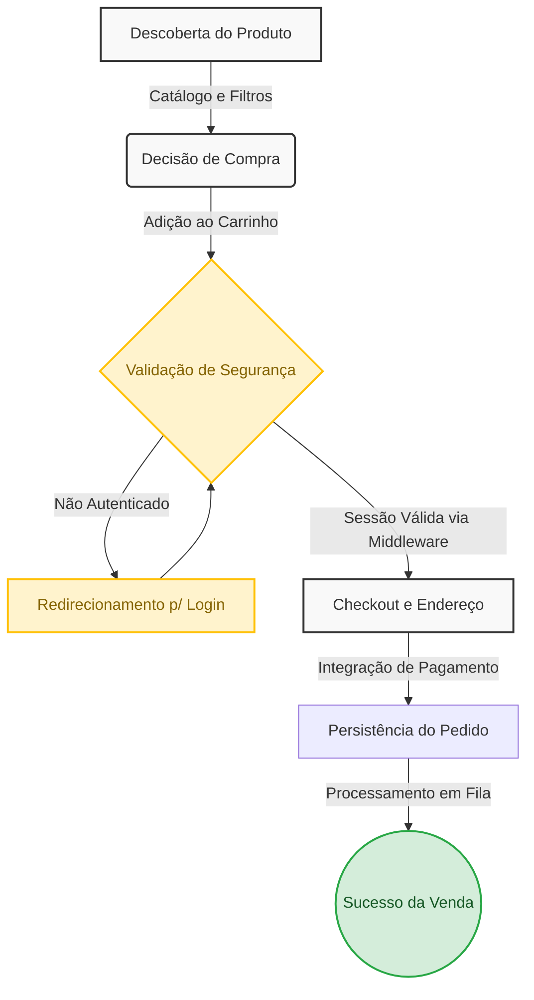
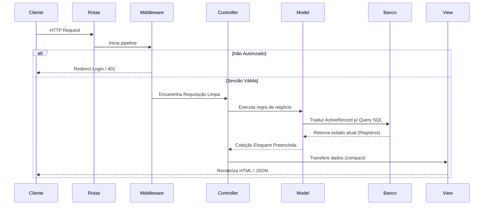
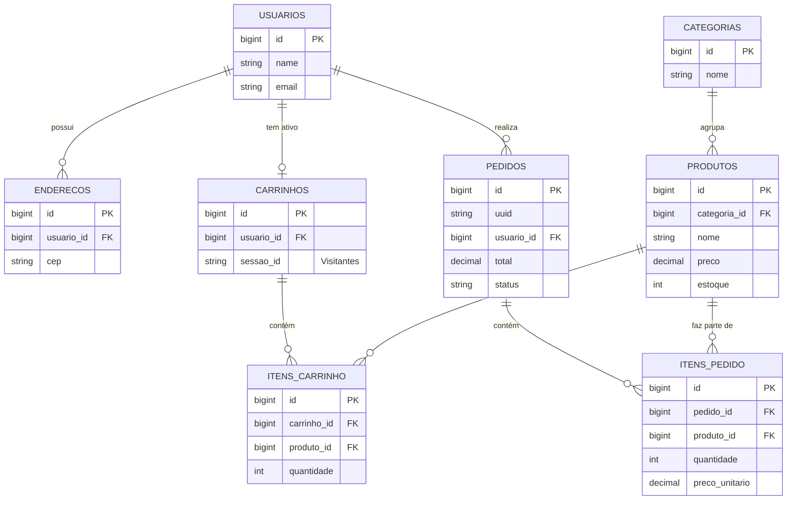

# Guia de Arquitetura e Engenharia: E-commerce Laravel

Este documento contém as representações visuais e arquiteturais do nosso sistema de E-commerce, modelado em Laravel. Ele foi criado como um material de apoio definitivo para que desenvolvedores (júniores e plenos) possam entender e explicar o ecossistema com a propriedade de um Arquiteto de Soluções.

---

## 1. Fluxo de Valor (A Jornada do Cliente)

Este diagrama demonstra a jornada do cliente e como as funcionalidades que desenvolvemos impactam diretamente o funil de vendas do negócio.



> **Explicação de 1 Minuto para a Equipe**
> *"Neste fluxo de valor, modelamos a jornada desde a **Descoberta do Produto** até a **Persistência do Pedido**. O ponto crucial de segurança ocorre antes do checkout: utilizamos os **Middlewares de Autenticação** do Laravel para barrar requisições não autorizadas, protegendo os dados sensíveis. A persistência do pedido é atômica no banco de dados e ações demoradas ocorrem em Filas."*

### Contexto em Código: Etapas do Fluxo
Aqui estão os trechos essenciais que materializam cada etapa desse diagrama no ecossistema:

**1. Descoberta do Produto:**
```php
// ProdutoController.php - Carregamento otimizado com Eager Loading
// O uso do 'with' previne o problema de N+1 queries.
$produtos = Produto::with('categoria')
    ->where('ativo', true)
    ->where('estoque', '>', 0)
    ->paginate(12);

return view('produtos.index', compact('produtos'));
```

**2. Adição ao Carrinho e Controle de Sessão:**
```php
// CarrinhoController.php - Resolve se é usuário logado ou visitante (sessão)
$carrinho = Carrinho::firstOrCreate([
    'usuario_id' => Auth::id(), 
    'sessao_id'  => Auth::check() ? null : session()->getId()
]);

// updateOrCreate evita duplicidade, garantindo a unique key no BD
$carrinho->itens()->updateOrCreate(
    ['produto_id' => $request->produto_id],
    [
        'quantidade' => DB::raw("quantidade + {$request->quantidade}"),
        'preco_unitario' => $produto->preco 
    ]
);
```

**3. Validação e Persistência do Pedido (Transação Atômica):**
```php
// CheckoutController.php
// Usamos DB::transaction para garantir que se algo falhar, NENHUM dado é salvo (Rollback).
DB::transaction(function () use ($carrinho, $request) {
    $pedido = Pedido::create([
        'uuid' => Str::uuid(),
        'usuario_id' => Auth::id(),
        'status' => 'processando',
        'subtotal' => $carrinho->calcularSubtotal(),
        'total' => $carrinho->calcularTotal(),
        'endereco_entrega' => json_encode($request->endereco_snapshot)
    ]);
    
    // Snapshot financeiro: Copiamos o carrinho pro pedido salvando os valores atuais
    foreach ($carrinho->itens as $item) {
        $pedido->itens()->create([
            'produto_id' => $item->produto_id,
            'nome_produto' => $item->produto->nome,
            'quantidade' => $item->quantidade,
            'preco_unitario' => $item->preco_unitario, // ⬅️ Congelamento histórico!
            'total' => $item->quantidade * $item->preco_unitario
        ]);
    }
    
    // Limpamos o carrinho após o sucesso da transação
    $carrinho->itens()->delete();
});
```

---

## 2. Arquitetura e Ciclo de Vida do Laravel

Este diagrama ilustra como orquestramos o ciclo de vida (Request Lifecycle) de forma resumida e direta.



> **Explicação de 1 Minuto para a Equipe**
> *"A requisição é validada pelo roteador e passa pelos **Middlewares**, resolvendo a segurança logo de início. O **Controller** atua como orquestrador magro: delega operações ao **Eloquent ORM** (Model), que cuida da interação segura com o Banco de Dados. Ao final, devolvemos a view renderizada."*

### Contexto em Código: Orquestração de Rotas e Middlewares
Para garantir a segurança demonstrada na arquitetura, configuramos nosso `routes/web.php` interceptando rotas sensíveis:

```php
// routes/web.php

// 1. Rotas Públicas (Acesso Livre)
Route::get('/', [InicioController::class, 'index'])->name('home');
Route::resource('produtos', ProdutoController::class)->only(['index', 'show']);
Route::resource('carrinho', CarrinhoController::class)->only(['index', 'store', 'update', 'destroy']);

// 2. Rotas Protegidas (Sessão Válida Exigida pelo Middleware 'auth')
Route::middleware('auth')->group(function () {
    
    Route::resource('checkout', CheckoutController::class)->only(['index', 'store']);
    Route::resource('pedidos', PedidoController::class)->only(['show']);
    Route::resource('enderecos', EnderecoController::class)->only(['store', 'destroy']);

    // 3. Middlewares Aninhados (Admin - IsAdmin.class)
    Route::middleware([\App\Http\Middleware\IsAdmin::class])
         ->prefix('admin')
         ->name('admin.')
         ->group(function () {
        Route::get('/', [PainelController::class, 'index'])->name('dashboard');
        Route::resource('produtos', AdminProdutoController::class)->only(['index', 'edit', 'update']);
    });
});
```

---

## 3. Modelo de Entidade-Relacionamento (MER)

Diagrama otimizado para evitar linhas cruzadas, com as entidades dispostas de forma hierárquica (do Domínio Principal até as tabelas Pivot).



> **Explicação de 1 Minuto para a Equipe**
> *"Nosso banco está normalizado focando na escalabilidade do E-commerce. O **Usuário** é a entidade pivot, possuindo relacionamentos 1:N com Endereços e Pedidos, e 1:1 com o Carrinho. Os **Produtos não ligam direto aos Pedidos ou Carrinhos**. Utilizamos tabelas intermediárias (ItemPedido e ItemCarrinho). Isso é vital para o sistema financeiro, pois salvamos o `preco_unitario` no momento da venda, congelando o preço permanentemente para aquele pedido."*

### Contexto em Código: As Migrations do Projeto
Esta seção contém exatamente como as tabelas do MER foram construídas utilizando a *Schema Builder* do Laravel, ilustrando a aplicação de *Foreign Keys*, exclusão em cascata e atributos Snapshot.

#### 1. Entidades Base (Usuários, Categorias e Produtos)
```php
// create_users_table.php
Schema::create('users', function (Blueprint $table) {
    $table->id();
    $table->string('name');
    $table->string('email')->unique();
    $table->string('password');
    $table->timestamps();
});

// create_categorias_table.php
Schema::create('categorias', function (Blueprint $table) {
    $table->id();
    $table->string('nome');
    $table->string('slug')->unique();
    $table->timestamps();
});

// create_produtos_table.php
Schema::create('produtos', function (Blueprint $table) {
    $table->id();
    $table->foreignId('categoria_id')->constrained('categorias')->cascadeOnDelete();
    $table->string('nome');
    $table->string('slug')->unique();
    $table->string('sku')->unique();
    $table->decimal('preco', 10, 2);
    $table->unsignedInteger('estoque')->default(0);
    $table->boolean('ativo')->default(true);
    $table->timestamps();
    $table->softDeletes(); 
});
```

#### 2. Entidades de Fluxo: Carrinho de Compras
```php
// create_carrinhos_table.php (Armazena a intenção de compra)
Schema::create('carrinhos', function (Blueprint $table) {
    $table->id();
    // FK nullable para permitir visitantes sem conta
    $table->foreignId('usuario_id')->nullable()->constrained('usuarios')->cascadeOnDelete();
    $table->string('sessao_id')->nullable()->index(); // ID da sessão para visitantes
    $table->timestamps();
});

// itens_carrinho (A Tabela Pivot)
Schema::create('itens_carrinho', function (Blueprint $table) {
    $table->id();
    $table->foreignId('carrinho_id')->constrained('carrinhos')->cascadeOnDelete();
    $table->foreignId('produto_id')->constrained('produtos')->cascadeOnDelete();
    $table->unsignedInteger('quantidade')->default(1);
    $table->decimal('preco_unitario', 10, 2);
    $table->timestamps();
    
    // Evita produtos duplicados no mesmo carrinho (apenas soma a quantidade no Controller)
    $table->unique(['carrinho_id', 'produto_id']); 
});
```

#### 3. Entidades de Consumação: Pedidos Financeiros
```php
// create_pedidos_table.php (Imutabilidade após o Checkout)
Schema::create('pedidos', function (Blueprint $table) {
    $table->id();
    $table->string('uuid')->unique(); // ID mascarado p/ rota pública e boletos
    $table->foreignId('usuario_id')->constrained('usuarios')->cascadeOnDelete();
    $table->enum('status', ['pendente', 'pago', 'processando', 'enviado', 'entregue', 'cancelado'])->default('pendente');
    $table->decimal('subtotal', 10, 2);
    $table->decimal('total', 10, 2);
    $table->json('endereco_entrega'); // Snapshot: salva o endereço atual para evitar alterações futuras
    $table->timestamps();
});

// itens_pedido (Isolamento Financeiro)
Schema::create('itens_pedido', function (Blueprint $table) {
    $table->id();
    $table->foreignId('pedido_id')->constrained('pedidos')->cascadeOnDelete();
    
    // Se o produto for excluído da loja, o histórico do pedido NÃO deve ser apagado (nullOnDelete)
    $table->foreignId('produto_id')->nullable()->constrained('produtos')->nullOnDelete();
    $table->string('nome_produto');   // Snapshot do nome 
    $table->decimal('preco_unitario', 10, 2); // Snapshot financeiro imutável
    $table->unsignedInteger('quantidade');
    $table->decimal('total', 10, 2);
    $table->timestamps();
});
```
