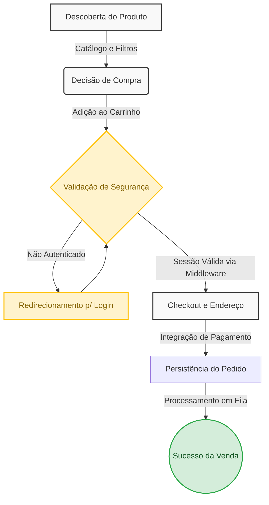
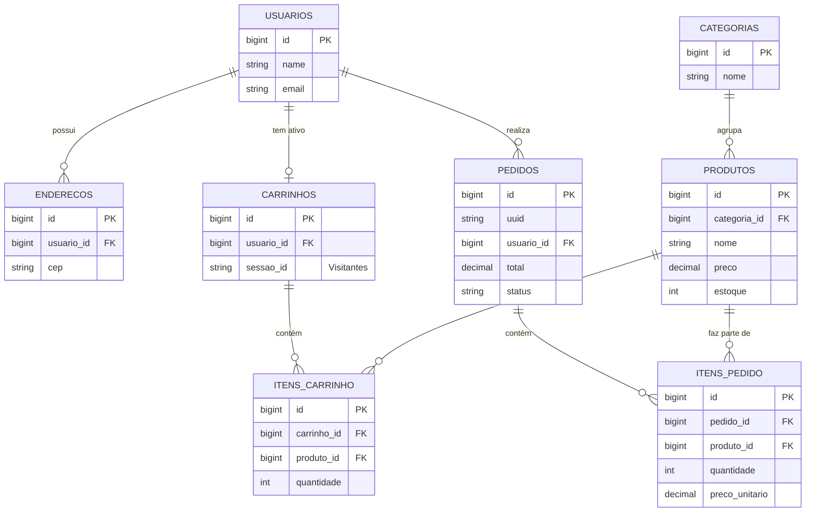

# Arquitetura E-commerce Laravel

Este documento contém as representações visuais e arquiteturais do nosso sistema de E-commerce, modelado em Laravel. Ele foi criado como um material de apoio definitivo para que desenvolvedores (júniores e plenos) possam entender e explicar o ecossistema com a propriedade de um Arquiteto de Soluções.

---

## 1. Fluxograma



> *"Neste fluxo de valor, modelamos a jornada desde a **Descoberta do Produto** até a **Persistência do Pedido**. Utilizamos os **Middlewares de Autenticação** do Laravel para barrar requisições não autorizadas, protegendo os dados sensíveis. A persistência do pedido é atômica no banco de dados e ações demoradas ocorrem em Filas."*

---

## 2. Requisitos e Casos de Uso

O Diagrama de Casos de Uso abaixo ilustra os atores (humanos e sistemas) e as fronteiras dentro do ecossistema.


> *"O Diagrama de Casos de Uso nos ajuda a entender as restrições e permissões do negócio. Observe que as funcionalidades de **Descoberta** e **Carrinho** estão abertas a Visitantes, maximizando nossas taxas de conversão inicial. O funil se fecha no **Checkout**, exigindo Autenticação para que o Cliente converse indiretamente com o Gateway de Pagamento, garantindo rastreabilidade. O Administrador possui uma fronteira totalmente isolada para gestão."*

### Contexto em Código: Etapas do Fluxo

**1. Descoberta do Produto:**
```php
// app/Http/Controllers/ProdutoController.php
public function index()
{
    // O 'with' chama o relacionamento definido no Model Produto
    $produtos = Produto::with('categoria')
        ->where('ativo', true)
        ->paginate(12);

    return view('produtos.index', compact('produtos'));
}
```

**2. Adição ao Carrinho**
```php
// app/Http/Controllers/CarrinhoController.php
public function store(Request $request)
{
    // Tenta encontrar um carrinho com o ID do usuário ou o ID da Sessão local
    $carrinho = Carrinho::firstOrCreate([
        'usuario_id' => Auth::id(), 
        'sessao_id'  => Auth::check() ? null : session()->getId()
    ]);

    // Cria o item ou apenas atualiza a quantidade 
    $carrinho->itens()->updateOrCreate(
        ['produto_id' => $request->produto_id],
        [
            // Se o item já existir, o banco entende e soma a quantidade!
            'quantidade' => DB::raw("quantidade + {$request->quantidade}"),
        ]
    );

    return back()->with('sucesso', 'Produto adicionado ao seu carrinho!');
}
```

**3. Validação e Persistência do Pedido (Transação Atômica):**
```php
// app/Http/Controllers/CheckoutController.php
class CheckoutController extends Controller
{
    // Exibe a tela de finalização de compra
    public function index(Request $request)
    {
        $carrinho = Carrinho::where('usuario_id',$request->user()->id)->with('itens.produto')->first();

        if (! $carrinho || $carrinho->itens->isEmpty()) {
            return redirect()->route('carrinho.index')->with('error', 'Seu carrinho está vazio.');
        }

        $enderecos = Endereco::where('usuario_id',$request->user()->id)->get();
        return view('checkout.index', compact('carrinho', 'enderecos'));
    }

    // Processa o fechamento do pedido
    public function store(Request $request)
    {
        // Validação local dos dados de entrega e pagamento
        $request->validate([
            'endereco_id' => 'required|exists:enderecos,id',
            'metodo_pagamento' => 'required|string',
            'codigo_cupom' => 'nullable|string'
        ]);

        $usuario = $request->user();
        $carrinho = Carrinho::where('usuario_id',$usuario->id)->with('itens.produto')->first();

        if (! $carrinho \vert{}\vert{}$carrinho->itens->isEmpty()) {
            return back()->with('error', 'O carrinho está vazio.');
        }

        $endereco = Endereco::where('usuario_id', $usuario->id)->findOrFail($request->endereco_id);

        try {
            // Execução da Transação (Garante consistência total)
            $pedido = DB::transaction(function () use ($usuario,$carrinho, $endereco,$request) {
                $subtotal = $carrinho->itens->sum(fn ($item) =>$item->preco_unitario * $item->quantidade);
                $desconto = 0;
                $cupom = null;

                // Validação e cálculo do cupom de desconto
                if ($request->codigo_cupom) {
                    $cupom = Cupom::where('codigo',$request->codigo_cupom)->first();

                    if (! $cupom || !$cupom->valido()) {
                        throw new \Exception('Cupom inválido ou expirado.');
                    }

                    $desconto = $cupom->calcularDesconto($subtotal);
                }

                // Criação do registro pedido com o Snapshot do endereço
                $pedido = Pedido::create([
                    'usuario_id' => $usuario->id,
                    'cupom_id' => $cupom?->id,
                    'subtotal' => $subtotal,
                    'desconto' => $desconto,
                    'frete' => 0,
                    'total' => $subtotal -$desconto,
                    'metodo_pagamento' => $request->metodo_pagamento,
                    'endereco_entrega' => $endereco->only(['rua', 'numero', 'complemento', 'bairro', 'cidade', 'estado', 'cep']),
                ]);

                // Criação dos itens do pedido com o "Snapshot" dos preços e baixa no estoque
                foreach ($carrinho->itens as $item) {$pedido->itens()->create([
                        'produto_id' => $item->produto_id,
                        'nome_produto' => $item->produto->nome,
                        'preco_unitario' => $item->preco_unitario, // Histórico de preço congelado aqui
                        'quantidade' => $item->quantidade,
                        'total' => $item->preco_unitario * $item->quantidade,
                    ]);

                    $item->produto()->decrement('estoque',$item->quantidade);
                }

                $carrinho->itens()->delete();

                return $pedido;
            });
        } catch (\Exception $e) {
            return back()->with('error', $e->getMessage());
        }

        return redirect()->route('pedidos.show', $pedido)->with('success', 'Pedido realizado!');
    }
}

```

---

## 3. Modelo de Entidade-Relacionamento (MER)

Diagrama otimizado para evitar linhas cruzadas, com as entidades dispostas de forma hierárquica (do Domínio Principal até as tabelas Pivot).



> O **Usuário** é a entidade pivot, possuindo relacionamentos 1:N com Endereços e Pedidos, e 1:1 com o Carrinho. Os **Produtos não ligam direto aos Pedidos ou Carrinhos**. Utilizamos tabelas intermediárias (ItemPedido e ItemCarrinho). Isso é vital para o sistema financeiro, pois salvamos o `preco_unitario` no momento da venda, congelando o preço permanentemente para aquele pedido."*

### Contexto em Código: As Migrations do Projeto
Esta seção contém exatamente como as tabelas do MER foram construídas utilizando a *Schema Builder* do Laravel, ilustrando a aplicação de *Foreign Keys*, exclusão em cascata e atributos Snapshot.

#### 1. Entidades Base (Usuários, Categorias e Produtos)
```php
Schema::create('users', function (Blueprint $table) {
    $table->id();
    $table->string('name');
    $table->string('email')->unique();
    $table->string('password');
    $table->timestamps();
});

Schema::create('categorias', function (Blueprint $table) {
    $table->id();
    $table->string('nome');
    $table->string('slug')->unique();
    $table->timestamps();
});

Schema::create('produtos', function (Blueprint $table) {
    $table->id();
    $table->foreignId('categoria_id')->constrained('categorias')->cascadeOnDelete();
    $table->string('nome');
    $table->string('slug')->unique();
    $table->string('sku')->unique();
    $table->decimal('preco', 10, 2);
    $table->unsignedInteger('estoque')->default(0);
    $table->boolean('ativo')->default(true);
    $table->timestamps();
    $table->softDeletes(); 
});
```

#### 2. Entidades de Fluxo: Carrinho de Compras
```php
Schema::create('carrinhos', function (Blueprint $table) {
    $table->id();
    $table->foreignId('usuario_id')->nullable()->constrained('usuarios')->cascadeOnDelete();
    $table->string('sessao_id')->nullable()->index();
    $table->timestamps();
});

Schema::create('itens_carrinho', function (Blueprint $table) {
    $table->id();
    $table->foreignId('carrinho_id')->constrained('carrinhos')->cascadeOnDelete();
    $table->foreignId('produto_id')->constrained('produtos')->cascadeOnDelete();
    $table->unsignedInteger('quantidade')->default(1);
    $table->decimal('preco_unitario', 10, 2);
    $table->timestamps();
    $table->unique(['carrinho_id', 'produto_id']); 
});
```

#### 3. Entidades de Consumação: Pedidos Financeiros
```php
Schema::create('pedidos', function (Blueprint $table) {
    $table->id();
    $table->string('uuid')->unique(); 
    $table->foreignId('usuario_id')->constrained('usuarios')->cascadeOnDelete();
    $table->enum('status', ['pendente', 'pago', 'processando', 'enviado', 'entregue', 'cancelado'])->default('pendente');
    $table->decimal('subtotal', 10, 2);
    $table->decimal('total', 10, 2);
    $table->json('endereco_entrega'); 
    $table->timestamps();
});

Schema::create('itens_pedido', function (Blueprint $table) {
    $table->id();
    $table->foreignId('pedido_id')->constrained('pedidos')->cascadeOnDelete();
    $table->foreignId('produto_id')->nullable()->constrained('produtos')->nullOnDelete();
    $table->string('nome_produto');   
    $table->decimal('preco_unitario', 10, 2); 
    $table->unsignedInteger('quantidade');
    $table->decimal('total', 10, 2);
    $table->timestamps();
});
```

---

## 4. Autenticação e Controle de Acesso

Ela garante que apenas as pessoas certas acessem áreas sensíveis, como o fechamento da compra (Checkout) e o painel de gerenciamento (Admin).

> O visitante pode olhar os Produtos e encher o carrinho livremente. Mas, na hora de passar no caixa (Checkout), precisa fazer login. Se for um funcionário (Admin), ele ganha uma chave mestra para acessar a sala do estoque. Tudo isso é gerenciado pelos **Middlewares**, que filtram quem passa por qual porta de forma invisível e segura.

### Contexto em Código: Rotas, Middlewares e Controllers

**1. A Barreira das Rotas**

O login só é exigido a partir do checkout. Já a área administrativa fica aninhada dentro do grupo autenticado e ganha uma camada extra: o middleware `IsAdmin`.

```php
// routes/web.php

// Área pública
Route::get('/', [InicioController::class, 'index'])->name('home');
Route::resource('produtos', ProdutoController::class)->only(['index', 'show']);
Route::resource('carrinho', CarrinhoController::class)->only(['index', 'store', 'update', 'destroy']);

// Avaliar um produto exige login, mesmo estando na área pública
Route::resource('produtos.avaliacoes', AvaliacaoController::class)->only(['store'])
    ->middleware('auth');

// Apenas Usuários Logados
Route::middleware('auth')->group(function () {
    Route::get('dashboard', function () {
        return Auth::user()->isAdmin()
            ? redirect()->route('admin.dashboard')
            : view('dashboard');
    })->name('dashboard');

    Route::resource('checkout', CheckoutController::class)->only(['index', 'store']);
    Route::resource('pedidos', PedidoController::class)->only(['show']);
    Route::resource('enderecos', EnderecoController::class)->only(['store', 'destroy']);

    Route::get('/perfil', [PerfilController::class, 'edit'])->name('profile.edit');
    Route::patch('/perfil', [PerfilController::class, 'update'])->name('profile.update');
    Route::delete('/perfil', [PerfilController::class, 'destroy'])->name('profile.destroy');

    // Apenas Administradores (auth + IsAdmin)
    Route::middleware([\App\Http\Middleware\IsAdmin::class])
        ->prefix('admin')
        ->name('admin.')
        ->group(function () {
            Route::get('/', [PainelController::class, 'index'])->name('dashboard');
            Route::resource('produtos', AdminProdutoController::class)->only(['index', 'edit', 'update']);
        });
});
```

**2. O Middleware Personalizado**

O Laravel já traz o middleware `auth` pronto para verificar se a pessoa está logada. Mas para a área administrativa da loja, criamos um guarda próprio (`IsAdmin`), que consulta o método `isAdmin()` do próprio usuário.

```php
// app/Http/Middleware/IsAdmin.php
namespace App\Http\Middleware;

use Closure;
use Illuminate\Http\Request;
use Symfony\Component\HttpFoundation\Response;

class IsAdmin
{
    public function handle(Request $request, Closure $next): Response
    {
        if (! $request->user() || ! $request->user()->isAdmin()) {
            abort(403, 'Acesso restrito à equipe administrativa.');
        }

        return $next($request);
    }
}
```
