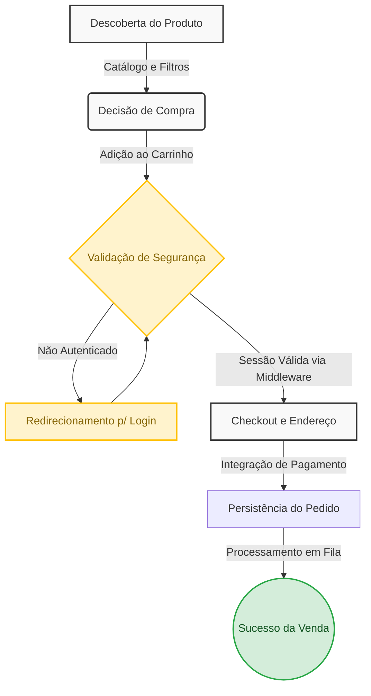
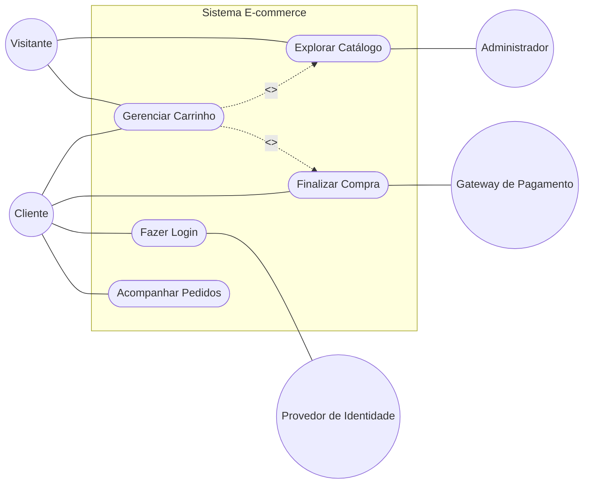
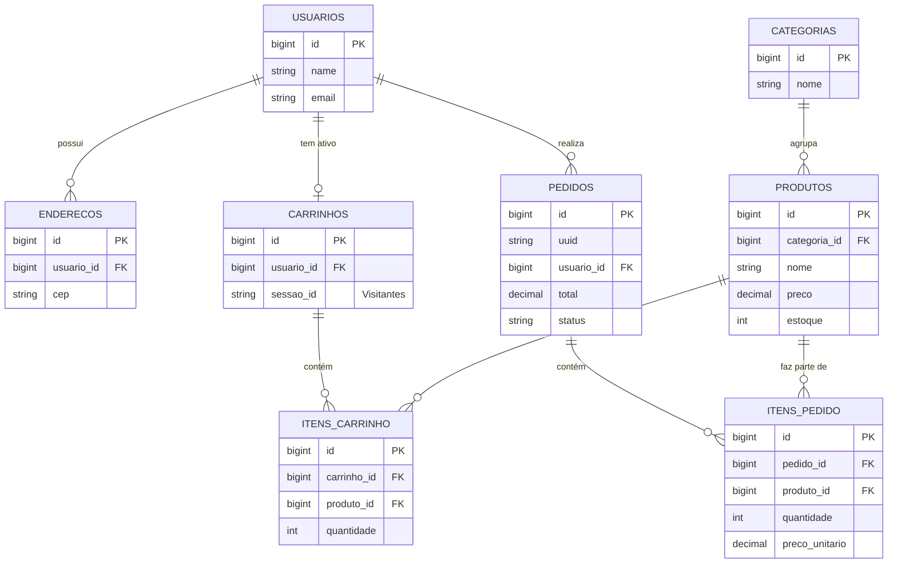

# Guia de Arquitetura e Engenharia: E-commerce Laravel

Este documento contém as representações visuais e arquiteturais do nosso sistema de E-commerce, modelado em Laravel. Ele foi criado como um material de apoio definitivo para que desenvolvedores (júniores e plenos) possam entender e explicar o ecossistema com a propriedade de um Arquiteto de Soluções.

---

## 1. Fluxo de Valor (A Jornada do Cliente)

Este diagrama demonstra a jornada do cliente e como as funcionalidades que desenvolvemos impactam diretamente o funil de vendas do negócio.



> *"Neste fluxo de valor, modelamos a jornada desde a **Descoberta do Produto** até a **Persistência do Pedido**. Utilizamos os **Middlewares de Autenticação** do Laravel para barrar requisições não autorizadas, protegendo os dados sensíveis. A persistência do pedido é atômica no banco de dados e ações demoradas ocorrem em Filas."*

### Contexto em Código: Etapas do Fluxo

**1. Descoberta do Produto:**
```php
// Carregamento de produtos com Eager Loading
$produtos = Produto::with('categoria')
    ->where('ativo', true)
    ->where('estoque', '>', 0)
    ->paginate(12);

return view('produtos.index', compact('produtos'));
```

**2. Adição ao Carrinho e Controle de Sessão:**
```php
// Resolve se é usuário logado ou visitante (sessão)
$carrinho = Carrinho::firstOrCreate([
    'usuario_id' => Auth::id(), 
    'sessao_id'  => Auth::check() ? null : session()->getId()
]);

// updateOrCreate evita duplicidade, garantindo a unique key no BD
$carrinho->itens()->updateOrCreate(
    ['produto_id' => $request->produto_id],
    [
        'quantidade' => DB::raw("quantidade + {$request->quantidade}"),
        'preco_unitario' => $produto->preco 
    ]
);
```

**3. Validação e Persistência do Pedido (Transação Atômica):**
```php
// CheckoutController.php
// DB::transaction para garantir que se algo falhar, NENHUM dado é salvo (Rollback).
DB::transaction(function () use ($carrinho, $request) {
    $pedido = Pedido::create([
        'uuid' => Str::uuid(),
        'usuario_id' => Auth::id(),
        'status' => 'processando',
        'subtotal' => $carrinho->calcularSubtotal(),
        'total' => $carrinho->calcularTotal(),
        'endereco_entrega' => json_encode($request->endereco_snapshot)
    ]);
    
    foreach ($carrinho->itens as $item) {
        $pedido->itens()->create([
            'produto_id' => $item->produto_id,
            'nome_produto' => $item->produto->nome,
            'quantidade' => $item->quantidade,
            'preco_unitario' => $item->preco_unitario, 
            'total' => $item->quantidade * $item->preco_unitario
        ]);
    }
    
    $carrinho->itens()->delete();
});
```

---

## 2. Requisitos e Casos de Uso (Visão Prática)

Em vez de focar apenas no ciclo de vida interno, esta seção mapeia de forma prática **o que** o sistema faz e **quem** tem a permissão de fazê-lo. O Diagrama de Casos de Uso abaixo ilustra os atores (humanos e sistemas) e as fronteiras dentro do ecossistema.



> *"O Diagrama de Casos de Uso nos ajuda a entender as restrições e permissões do negócio. Observe que as funcionalidades de **Descoberta** e **Carrinho** (UC1, UC2) estão abertas a Visitantes, maximizando nossas taxas de conversão inicial. O funil se fecha no **Checkout** (UC4), exigindo Autenticação para que o Cliente converse indiretamente com o Gateway de Pagamento, garantindo rastreabilidade. O Administrador possui uma fronteira totalmente isolada para gestão."*

### Contexto em Código: Implementando as Permissões e Requisitos

A implementação prática deste diagrama no Laravel exige controle rígido de acesso através de **Middlewares** e inteligência no armazenamento temporário (Sessão).

**1. Carrinho Flexível (Atores: Visitante e Cliente)**
O sistema deve permitir que Visitantes anônimos criem carrinhos, que posteriomente serão transferidos quando logarem. Resolvemos isso atrelando o carrinho ao `sessao_id` ou ao `usuario_id`:
```php
// app/Http/Controllers/CarrinhoController.php
public function store(Request $request)
{
    $carrinho = Carrinho::firstOrCreate([
        'usuario_id' => Auth::id(), 
        'sessao_id'  => Auth::check() ? null : session()->getId() 
    ]);

    $carrinho->itens()->create(['produto_id' => $request->produto_id]);
}
```

**2. A Fronteira do Checkout (Casos UC3 e UC4)**
O Checkout exige uma transição de status (Visitante para Cliente Logado). Protegemos as rotas de conversão final e acompanhamento de pedidos utilizando o middleware nativo `auth`.
```php

Route::resource('carrinho', CarrinhoController::class);
Route::middleware('auth')->group(function () {
    Route::resource('checkout', CheckoutController::class)->only(['index', 'store']);
    Route::resource('pedidos', PedidoController::class)->only(['show']);
});
```

**3. Isolamento Administrativo e de Catálogo (Caso UC7)**
O gerenciamento de estoque deve ser completamente blindado contra explorações. Utilizamos um middleware personalizado (`IsAdmin`) em cadeia para barrar até mesmo Clientes logados que não sejam administradores.
```php

Route::middleware(['auth', \App\Http\Middleware\IsAdmin::class])
     ->prefix('admin')
     ->group(function () {
         Route::resource('produtos', AdminProdutoController::class);
});
```

---

## 3. Modelo de Entidade-Relacionamento (MER)

Diagrama otimizado para evitar linhas cruzadas, com as entidades dispostas de forma hierárquica (do Domínio Principal até as tabelas Pivot).



> O **Usuário** é a entidade pivot, possuindo relacionamentos 1:N com Endereços e Pedidos, e 1:1 com o Carrinho. Os **Produtos não ligam direto aos Pedidos ou Carrinhos**. Utilizamos tabelas intermediárias (ItemPedido e ItemCarrinho). Isso é vital para o sistema financeiro, pois salvamos o `preco_unitario` no momento da venda, congelando o preço permanentemente para aquele pedido."*

### Contexto em Código: As Migrations do Projeto
Esta seção contém exatamente como as tabelas do MER foram construídas utilizando a *Schema Builder* do Laravel, ilustrando a aplicação de *Foreign Keys*, exclusão em cascata e atributos Snapshot.

#### 1. Entidades Base (Usuários, Categorias e Produtos)
```php
Schema::create('users', function (Blueprint $table) {
    $table->id();
    $table->string('name');
    $table->string('email')->unique();
    $table->string('password');
    $table->timestamps();
});

Schema::create('categorias', function (Blueprint $table) {
    $table->id();
    $table->string('nome');
    $table->string('slug')->unique();
    $table->timestamps();
});

Schema::create('produtos', function (Blueprint $table) {
    $table->id();
    $table->foreignId('categoria_id')->constrained('categorias')->cascadeOnDelete();
    $table->string('nome');
    $table->string('slug')->unique();
    $table->string('sku')->unique();
    $table->decimal('preco', 10, 2);
    $table->unsignedInteger('estoque')->default(0);
    $table->boolean('ativo')->default(true);
    $table->timestamps();
    $table->softDeletes(); 
});
```

#### 2. Entidades de Fluxo: Carrinho de Compras
```php
Schema::create('carrinhos', function (Blueprint $table) {
    $table->id();
    $table->foreignId('usuario_id')->nullable()->constrained('usuarios')->cascadeOnDelete();
    $table->string('sessao_id')->nullable()->index();
    $table->timestamps();
});

Schema::create('itens_carrinho', function (Blueprint $table) {
    $table->id();
    $table->foreignId('carrinho_id')->constrained('carrinhos')->cascadeOnDelete();
    $table->foreignId('produto_id')->constrained('produtos')->cascadeOnDelete();
    $table->unsignedInteger('quantidade')->default(1);
    $table->decimal('preco_unitario', 10, 2);
    $table->timestamps();
    $table->unique(['carrinho_id', 'produto_id']); 
});
```

#### 3. Entidades de Consumação: Pedidos Financeiros
```php
Schema::create('pedidos', function (Blueprint $table) {
    $table->id();
    $table->string('uuid')->unique(); 
    $table->foreignId('usuario_id')->constrained('usuarios')->cascadeOnDelete();
    $table->enum('status', ['pendente', 'pago', 'processando', 'enviado', 'entregue', 'cancelado'])->default('pendente');
    $table->decimal('subtotal', 10, 2);
    $table->decimal('total', 10, 2);
    $table->json('endereco_entrega'); 
    $table->timestamps();
});

Schema::create('itens_pedido', function (Blueprint $table) {
    $table->id();
    $table->foreignId('pedido_id')->constrained('pedidos')->cascadeOnDelete();
    $table->foreignId('produto_id')->nullable()->constrained('produtos')->nullOnDelete();
    $table->string('nome_produto');   
    $table->decimal('preco_unitario', 10, 2); 
    $table->unsignedInteger('quantidade');
    $table->decimal('total', 10, 2);
    $table->timestamps();
});
```

---

## 4. Autenticação e Controle de Acesso

Ela garante que apenas as pessoas certas acessem áreas sensíveis, como o fechamento da compra (Checkout) e o painel de gerenciamento (Admin).

> O visitante pode olhar os Produtos e encher o carrinho livremente. Mas, na hora de passar no caixa (Checkout), precisa fazer login. Se for um funcionário (Admin), ele ganha uma chave mestra para acessar a sala do estoque. Tudo isso é gerenciado pelos **Middlewares**, que filtram quem passa por qual porta de forma invisível e segura."

### Contexto em Código: Rotas, Middlewares e Controllers

O ecossistema de segurança é composto por três peças principais trabalhando em sincronia: o arquivo de Rotas (`web.php`), os **Middlewares** (os seguranças) e os **Controllers** de Autenticação.

**1. A Barreira das Rotas (Onde o segurança fica)**
No Laravel, nós não precisamos colocar lógica de segurança dentro de cada Controller. Nós "envelopamos" as rotas com middlewares. Se o usuário não tiver permissão, ele é barrado *antes* mesmo de chegar ao Controller.

```php
// routes/web.php

Route::get('/', [InicioController::class, 'index']);
Route::get('/produtos', [ProdutoController::class, 'index']);

// Apenas Usuários Logados
Route::middleware('auth')->group(function () {
    Route::get('/checkout', [CheckoutController::class, 'index'])->name('checkout');
    Route::get('/meus-pedidos', [PedidoController::class, 'index'])->name('pedidos');
});

// Apenas Administradores
Route::middleware(['auth', \App\Http\Middleware\IsAdmin::class])->group(function () {
    Route::resource('/admin/produtos', AdminProdutoController::class);
});
```

**2. O Middleware Personalizado (Checando o Crachá)**
O Laravel já traz o middleware `auth` pronto para verificar se a pessoa está logada. Mas para a área administrativa da loja, criamos um guarda próprio (`IsAdmin`).

```php
// app/Http/Middleware/IsAdmin.php
namespace App\Http\Middleware;

use Closure;
use Illuminate\Http\Request;
use Illuminate\Support\Facades\Auth;

class IsAdmin
{
    public function handle(Request $request, Closure $next)
    {
        if (Auth::check() && Auth::user()->is_admin) {
            return $next($request); 
        }

        abort(403, 'Acesso restrito apenas para administradores.');
    }
}
```

**3. Integração com Controllers (Recuperando a Identidade)**
Uma vez que o middleware validou o acesso e deixou o usuário passar, o Controller trabalha com a certeza absoluta de que a requisição é confiável. O Controller então pode resgatar facilmente a identidade dessa pessoa para realizar as ações, como gravar os pedidos atrelados a ele.

```php
// app/Http/Controllers/CheckoutController.php
namespace App\Http\Controllers;

use Illuminate\Support\Facades\Auth;
use Illuminate\Http\Request;

class CheckoutController extends Controller
{
    public function store(Request $request)
    {
        $usuarioAtual = Auth::user();
        $pedido = $usuarioAtual->pedidos()->create([
            'total' => $request->total_carrinho,
            'status' => 'processando'
        ]);

        return redirect()->route('sucesso');
    }
}
```
