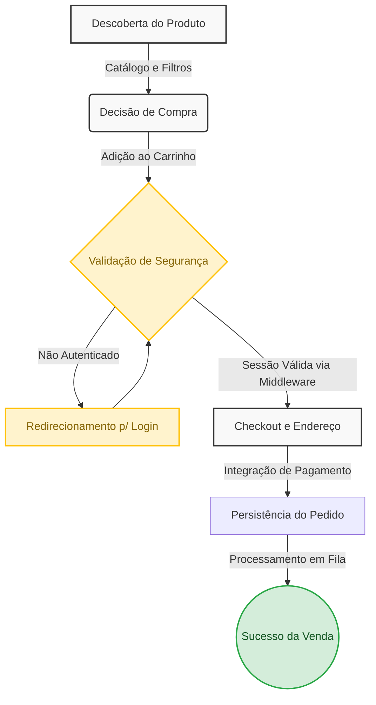
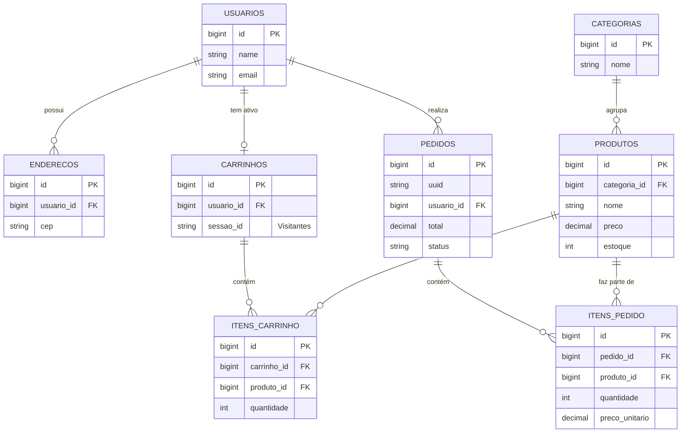

# Guia de Arquitetura e Engenharia: E-commerce Laravel

Este documento contém as representações visuais e arquiteturais do nosso sistema de E-commerce, modelado em Laravel. Ele foi criado como um material de apoio definitivo para que desenvolvedores (júniores e plenos) possam entender e explicar o ecossistema com a propriedade de um Arquiteto de Soluções.

---

## 1. Fluxo de Valor (A Jornada do Cliente)

Este diagrama demonstra a jornada do cliente e como as funcionalidades que desenvolvemos impactam diretamente o funil de vendas do negócio.



> *"Neste fluxo de valor, modelamos a jornada desde a **Descoberta do Produto** até a **Persistência do Pedido**. Utilizamos os **Middlewares de Autenticação** do Laravel para barrar requisições não autorizadas, protegendo os dados sensíveis. A persistência do pedido é atômica no banco de dados e ações demoradas ocorrem em Filas."*

### Contexto em Código: Etapas do Fluxo

**1. Descoberta do Produto:**
```php
// ProdutoController.php - Carregamento de produtos com Eager Loading
// O uso do 'with' previne o problema de N+1 queries.
$produtos = Produto::with('categoria')
    ->where('ativo', true)
    ->where('estoque', '>', 0)
    ->paginate(12);

return view('produtos.index', compact('produtos'));
```

**2. Adição ao Carrinho e Controle de Sessão:**
```php
// CarrinhoController.php - Resolve se é usuário logado ou visitante (sessão)
$carrinho = Carrinho::firstOrCreate([
    'usuario_id' => Auth::id(), 
    'sessao_id'  => Auth::check() ? null : session()->getId()
]);

// updateOrCreate evita duplicidade, garantindo a unique key no BD
$carrinho->itens()->updateOrCreate(
    ['produto_id' => $request->produto_id],
    [
        'quantidade' => DB::raw("quantidade + {$request->quantidade}"),
        'preco_unitario' => $produto->preco 
    ]
);
```

**3. Validação e Persistência do Pedido (Transação Atômica):**
```php
// CheckoutController.php
// Usamos DB::transaction para garantir que se algo falhar, NENHUM dado é salvo (Rollback).
DB::transaction(function () use ($carrinho, $request) {
    $pedido = Pedido::create([
        'uuid' => Str::uuid(),
        'usuario_id' => Auth::id(),
        'status' => 'processando',
        'subtotal' => $carrinho->calcularSubtotal(),
        'total' => $carrinho->calcularTotal(),
        'endereco_entrega' => json_encode($request->endereco_snapshot)
    ]);
    
    // Copiamos o carrinho pro pedido salvando os valores atuais
    foreach ($carrinho->itens as $item) {
        $pedido->itens()->create([
            'produto_id' => $item->produto_id,
            'nome_produto' => $item->produto->nome,
            'quantidade' => $item->quantidade,
            'preco_unitario' => $item->preco_unitario, // Congelamento histórico!
            'total' => $item->quantidade * $item->preco_unitario
        ]);
    }
    
    // Limpeza do carrinho após o sucesso da transação
    $carrinho->itens()->delete();
});
```

---

## 2. Arquitetura e Ciclo de Vida do Request (Lifecycle)

A arquitetura segue os princípios MVC aprimorados com o padrão **Service/Action** para isolar a lógica de negócio dos Controllers, e **Form Requests** para delegação de validação. O ciclo de vida de uma requisição típica (ex: Adicionar ao Carrinho) segue o fluxo linear abaixo:

| Estágio | Componente / Processo | Detalhes Técnicos |
| :--- | :--- | :--- |
| **1. Ingestão** | `public/index.php` & Autoloader | Ponto de entrada único. Inicializa o Composer Autoloader e faz o bootstrap da aplicação via Container de Injeção de Dependência (IoC). |
| **2. Kernel** | HTTP Kernel (`App\Http\Kernel`) | Trata a requisição globalmente. Carrega variáveis de ambiente, inicializa logs e passa pelos middlewares globais. |
| **3. Roteamento** | Router & Route Model Binding | Resolve a rota URI (`/cart/add/{product}`). O *Implicit Route Model Binding* injeta instâncias do modelo `Product` diretamente. |
| **4. Interceptação** | Middlewares Específicos | Passa pelas camadas de proteção: `web` e `auth` (se aplicável), garantindo contexto de sessão seguro e validado. |
| **5. Validação** | Form Request (`AddToCartRequest`) | Intercepta o request antes do Controller. Regras de negócio são validadas aqui. Falhas geram redirect imediato. |
| **6. Controle** | Controller (`CartController`) | Magro (Thin Controller). Recebe a requisição sanitizada e a instância do modelo. Delega a operação para o Service. |
| **7. Negócio** | Service (`CartService`) | Contém a lógica complexa de domínio (cálculo de descontos, concorrência). Utiliza *Database Transactions* para consistência. |
| **8. Persistência** | Eloquent ORM & DB | Executa as queries. Utiliza *Eager Loading* para prevenir problemas de N+1 ao recuperar relacionamentos. |
| **9. Resposta** | Blade View / JSON Response | Renderiza a view `checkout.blade.php`. O Vite injeta o CSS (Tailwind) e o bundle JS (GSAP). |
| **10. Apresentação** | Browser & GSAP (Client-side) | O DOM é renderizado. GSAP assume o controle para animações de transição de estado da UI sem bloqueio da main thread. |

> **Explicação de 1 Minuto para a Equipe**
> *"Nossa arquitetura prioriza a separação de responsabilidades. Em vez de entulhar o Controller, a requisição é higienizada pelos **Middlewares** e **Form Requests**. O Controller serve apenas como um 'maestro' magro, que repassa o trabalho pesado para a camada de **Service**. Isso facilita os testes, a manutenção e garante que regras complexas de e-commerce fiquem isoladas do fluxo HTTP."*

### Contexto em Código: Prova de Conceito (PoC) da Arquitetura
As decisões arquiteturais priorizam testes, manutenção e desacoplamento. Veja na prática como orquestramos isso:

**1. Injeção de Dependência e Controllers Magros**
Em vez de instanciar classes diretamente, os serviços são vinculados no Container e resolvidos via construtor.
```php
// App\Http\Controllers\CheckoutController.php

use App\Http\Requests\ProcessCheckoutRequest;
use App\Services\Contracts\CheckoutServiceInterface;

class CheckoutController extends Controller
{
    // A interface é injetada, desacoplando a implementação concreta e facilitando Mocking
    public function __construct(
        private readonly CheckoutServiceInterface $checkoutService
    ) {}

    public function store(ProcessCheckoutRequest $request): RedirectResponse
    {
        // Controller apenas orquestra: Request validado -> Serviço de Domínio -> Resposta
        $order = $this->checkoutService->processOrder($request->validated(), $request->user());

        return redirect()->route('checkout.success', $order)
                         ->with('status', 'Pedido processado com sucesso.');
    }
}
```

**2. Validações e Segurança (Form Requests)**
Toda entrada é estritamente validada e sanitizada para prevenir XSS e Injections.
```php
// App\Http\Requests\ProcessCheckoutRequest.php
public function rules(): array
{
    return [
        // 'exists' previne IDs arbitrários manipulados no front-end.
        'payment_method' => ['required', 'string', 'in:credit_card,pix,boleto'],
        'address_id' => ['required', 'integer', 'exists:enderecos,id'],
        // Sanitização implícita: apenas chaves definidas aqui são acessíveis via $request->validated()
    ];
}
```

**3. Integração Front-end: Tailwind & GSAP via Vite**
O GSAP é encapsulado em módulos JavaScript para manter o controle de animações isolado da marcação Blade.
```blade
<!-- resources/views/checkout/index.blade.php -->
<x-app-layout>
    <div id="checkout-container" class="opacity-0 grid grid-cols-1 md:grid-cols-2 gap-8">
        <x-checkout.form />
        <x-checkout.summary />
    </div>

    @push('scripts')
    @vite(['resources/js/animations/checkout.js'])
    @endpush
</x-app-layout>
```

```javascript
// resources/js/animations/checkout.js
import { gsap } from 'gsap';

document.addEventListener('DOMContentLoaded', () => {
    // Reveal suave e stagger dos elementos do checkout garantindo UX premium
    gsap.to('#checkout-container', { opacity: 1, duration: 0.6, ease: 'power2.out' });
    gsap.from('.checkout-item', { y: 20, opacity: 0, stagger: 0.1, duration: 0.5, ease: 'back.out(1.7)' });
});
```


---

## 3. Modelo de Entidade-Relacionamento (MER)

Diagrama otimizado para evitar linhas cruzadas, com as entidades dispostas de forma hierárquica (do Domínio Principal até as tabelas Pivot).



> **Explicação de 1 Minuto para a Equipe**
> *"Nosso banco está normalizado focando na escalabilidade do E-commerce. O **Usuário** é a entidade pivot, possuindo relacionamentos 1:N com Endereços e Pedidos, e 1:1 com o Carrinho. Os **Produtos não ligam direto aos Pedidos ou Carrinhos**. Utilizamos tabelas intermediárias (ItemPedido e ItemCarrinho). Isso é vital para o sistema financeiro, pois salvamos o `preco_unitario` no momento da venda, congelando o preço permanentemente para aquele pedido."*

### Contexto em Código: As Migrations do Projeto
Esta seção contém exatamente como as tabelas do MER foram construídas utilizando a *Schema Builder* do Laravel, ilustrando a aplicação de *Foreign Keys*, exclusão em cascata e atributos Snapshot.

#### 1. Entidades Base (Usuários, Categorias e Produtos)
```php
// create_users_table.php
Schema::create('users', function (Blueprint $table) {
    $table->id();
    $table->string('name');
    $table->string('email')->unique();
    $table->string('password');
    $table->timestamps();
});

// create_categorias_table.php
Schema::create('categorias', function (Blueprint $table) {
    $table->id();
    $table->string('nome');
    $table->string('slug')->unique();
    $table->timestamps();
});

// create_produtos_table.php
Schema::create('produtos', function (Blueprint $table) {
    $table->id();
    $table->foreignId('categoria_id')->constrained('categorias')->cascadeOnDelete();
    $table->string('nome');
    $table->string('slug')->unique();
    $table->string('sku')->unique();
    $table->decimal('preco', 10, 2);
    $table->unsignedInteger('estoque')->default(0);
    $table->boolean('ativo')->default(true);
    $table->timestamps();
    $table->softDeletes(); 
});
```

#### 2. Entidades de Fluxo: Carrinho de Compras
```php
// create_carrinhos_table.php (Armazena a intenção de compra)
Schema::create('carrinhos', function (Blueprint $table) {
    $table->id();
    // FK nullable para permitir visitantes sem conta
    $table->foreignId('usuario_id')->nullable()->constrained('usuarios')->cascadeOnDelete();
    $table->string('sessao_id')->nullable()->index(); // ID da sessão para visitantes
    $table->timestamps();
});

// itens_carrinho (A Tabela Pivot)
Schema::create('itens_carrinho', function (Blueprint $table) {
    $table->id();
    $table->foreignId('carrinho_id')->constrained('carrinhos')->cascadeOnDelete();
    $table->foreignId('produto_id')->constrained('produtos')->cascadeOnDelete();
    $table->unsignedInteger('quantidade')->default(1);
    $table->decimal('preco_unitario', 10, 2);
    $table->timestamps();
    
    // Evita produtos duplicados no mesmo carrinho (apenas soma a quantidade no Controller)
    $table->unique(['carrinho_id', 'produto_id']); 
});
```

#### 3. Entidades de Consumação: Pedidos Financeiros
```php
// create_pedidos_table.php (Imutabilidade após o Checkout)
Schema::create('pedidos', function (Blueprint $table) {
    $table->id();
    $table->string('uuid')->unique(); // ID mascarado p/ rota pública e boletos
    $table->foreignId('usuario_id')->constrained('usuarios')->cascadeOnDelete();
    $table->enum('status', ['pendente', 'pago', 'processando', 'enviado', 'entregue', 'cancelado'])->default('pendente');
    $table->decimal('subtotal', 10, 2);
    $table->decimal('total', 10, 2);
    $table->json('endereco_entrega'); // Snapshot: salva o endereço atual para evitar alterações futuras
    $table->timestamps();
});

// itens_pedido (Isolamento Financeiro)
Schema::create('itens_pedido', function (Blueprint $table) {
    $table->id();
    $table->foreignId('pedido_id')->constrained('pedidos')->cascadeOnDelete();
    
    // Se o produto for excluído da loja, o histórico do pedido NÃO deve ser apagado (nullOnDelete)
    $table->foreignId('produto_id')->nullable()->constrained('produtos')->nullOnDelete();
    $table->string('nome_produto');   // Snapshot do nome 
    $table->decimal('preco_unitario', 10, 2); // Snapshot financeiro imutável
    $table->unsignedInteger('quantidade');
    $table->decimal('total', 10, 2);
    $table->timestamps();
});
```

---

## 4. Testes e Validações (Segurança e Integridade)

A estratégia de testes garante a resiliência do core de negócio e a segurança das APIs, utilizando o framework de testes (PHPUnit/Pest). Adotamos uma abordagem piramidal, cobrindo desde regras isoladas de negócio até a persistência real no banco de dados.

> **Explicação de 1 Minuto para a Equipe**
> *"A regra de ouro é: **nunca confie no input do usuário**. Nossos testes devem garantir que cupons inválidos não passem, que o estoque não fique negativo e que o fluxo de checkout persista corretamente as informações financeiras. Dividimos a responsabilidade: os **Testes Unitários** validam o cálculo matemático (rápido e sem banco), e os **Feature Tests** validam se o clique no botão realmente salva a venda de ponta a ponta."*

### Contexto em Código: Estratégia de Testes Prática

**1. Testes Unitários (Domain Logic Isolada)**
Testam a lógica de negócio sem interagir com o banco de dados. Foco total em algoritmos de e-commerce.

```php
// tests/Unit/Services/DiscountCalculatorTest.php
use App\Services\DiscountCalculator;
use App\Models\Coupon;

test('calcula desconto percentual corretamente', function () {
    $calculator = new DiscountCalculator();
    $coupon = new Coupon(['type' => 'percent', 'value' => 20]);
    
    $total = 1000.00; // Representado em centavos ou decimais (ex: R$ 10,00)
    
    $discounted = $calculator->apply($total, $coupon);
    
    // Assegura que 20% de 1000 é abatido, resultando em 800
    expect($discounted)->toBe(800.00);
});
```

**2. Testes de Integração (Feature Tests de Checkout)**
Simulam fluxos completos (End-to-End no backend), utilizando `RefreshDatabase` para estado limpo.

```php
// tests/Feature/CheckoutFlowTest.php
use App\Models\User;
use App\Models\Product;
use Illuminate\Foundation\Testing\RefreshDatabase;

uses(RefreshDatabase::class);

test('usuário autenticado pode concluir checkout', function () {
    $user = User::factory()->create();
    $product = Product::factory()->create(['preco' => 5000, 'estoque' => 10]);

    // Simula a adição ao carrinho e autenticação em cadeia
    $this->actingAs($user)
         ->postJson('/carrinho/add', ['produto_id' => $product->id, 'quantidade' => 1])
         ->assertStatus(200);

    // Submete o payload final do checkout
    $response = $this->post('/checkout', [
        'payment_method' => 'credit_card',
        'endereco_id' => 1,
    ]);

    // Valida redirecionamento de sucesso e integridade relacional
    $response->assertRedirect('/checkout/success');
    
    $this->assertDatabaseHas('pedidos', [
        'usuario_id' => $user->id,
        'status' => 'processando',
    ]);
    
    // Verifica dedução atômica de inventário no banco
    $this->assertDatabaseHas('produtos', [
        'id' => $product->id,
        'estoque' => 9, 
    ]);
});
```
